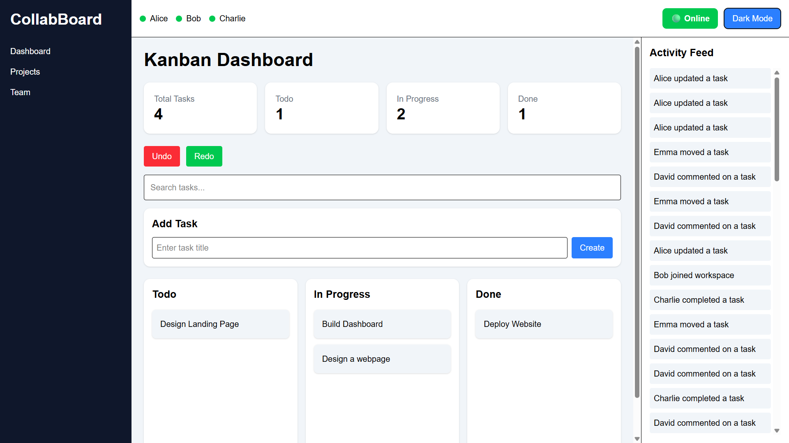

# Live Collaboration Dashboard

A modern SaaS-inspired collaboration dashboard built using React, Zustand, Tailwind CSS, React Router, and Framer Motion.

## Dashboard Preview



## Features

- Kanban Board
- Drag & Drop
- Search Tasks
- Add Tasks
- Undo / Redo
- Activity Feed
- Presence Indicators
- Analytics Dashboard
- Dark Mode
- Offline Detection
- Command Palette (Ctrl + K)
- Toast Notifications
- LocalStorage Persistence

## Tech Stack

- React
- Vite
- Zustand
- Tailwind CSS
- React Router
- Framer Motion
- @hello-pangea/dnd

## Installation

```bash
npm install
npm run dev
```

## Build

```bash
npm run build
```

## Author

Jitesh Varshney  
VIT Vellore
